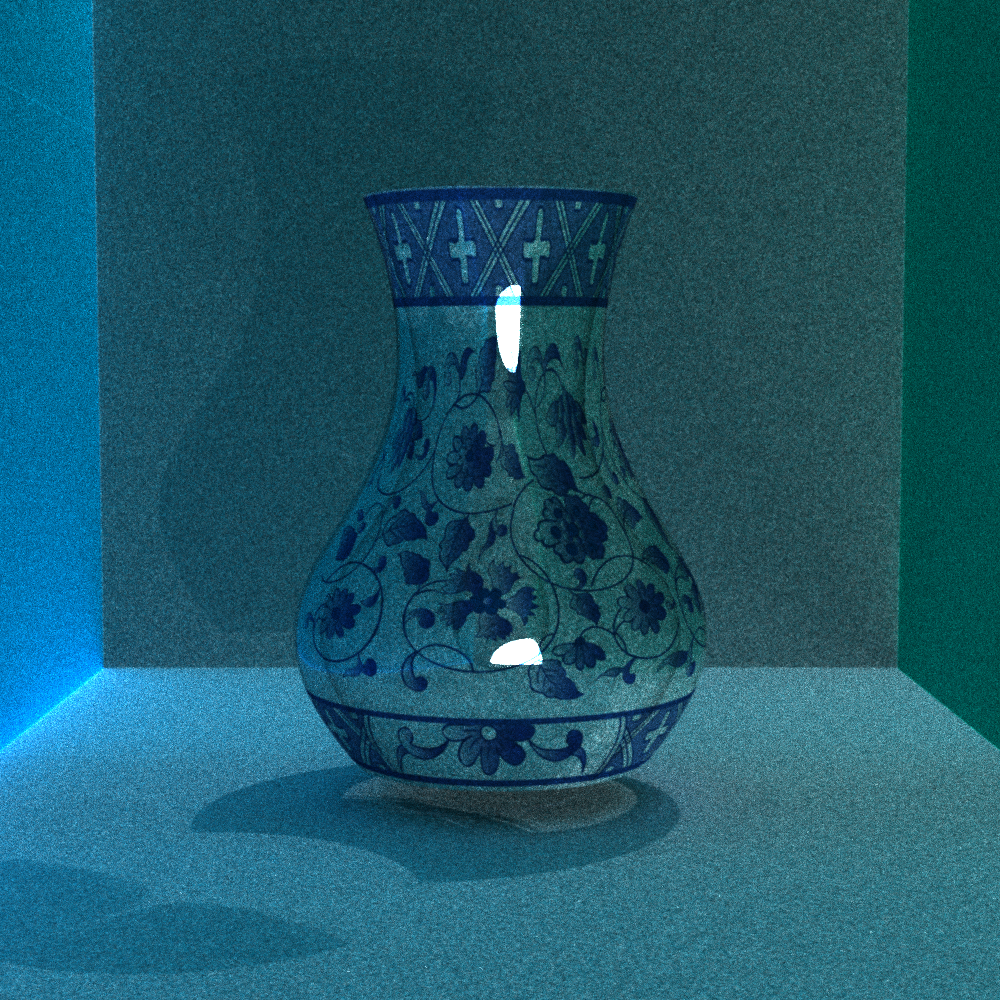
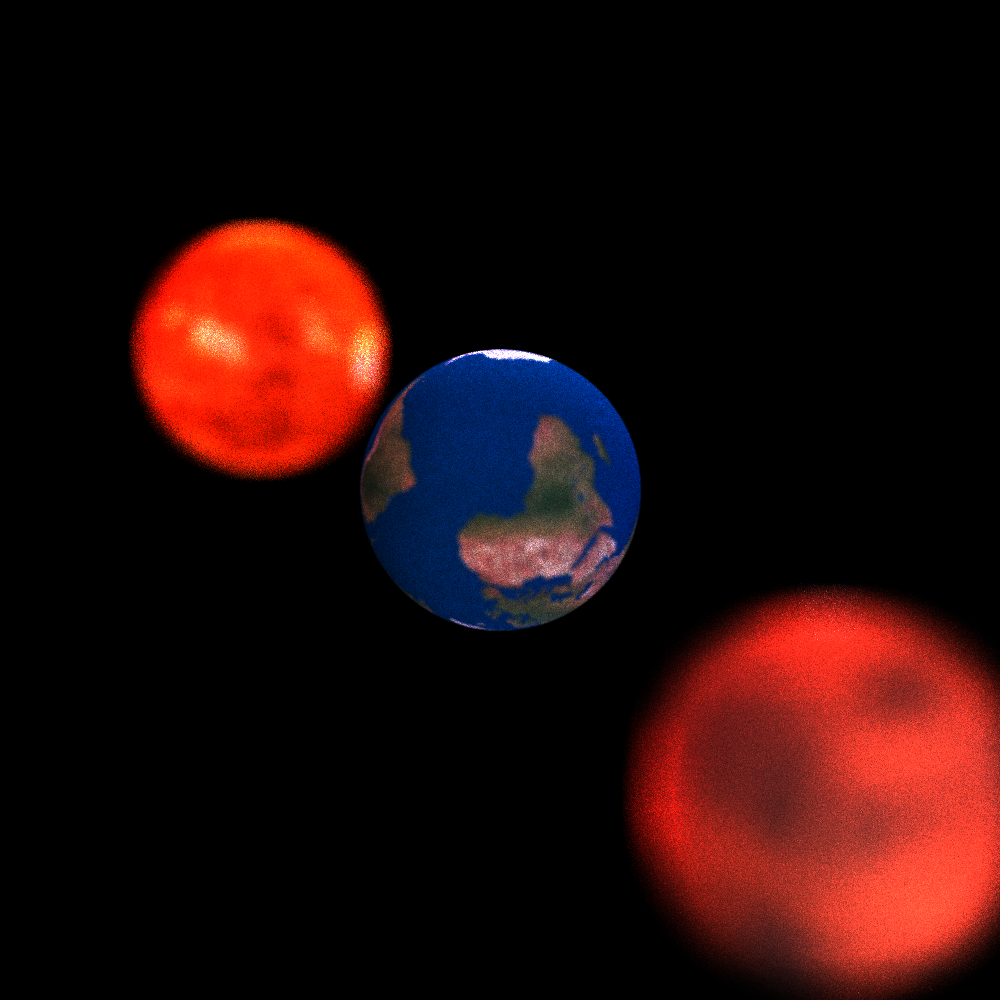

计算机图形学基础

胡事民老师的课

To Be Honest，线下没有去过一次，因为是早八，真的起不来。每次就是雨课堂上做题，因为占 20 分，还好现在雨课堂有 bug，可以直接 F12 出答案，要不然那个题真的不会做。问题是随堂小测占 20 分。。。

四次小作业真的是万年不变，可以找到 2018-2020 年的 n 多代码，看懂之后自己写一遍问题不大

今年大作业仍然是风景生成比赛和光线追踪二选一。但是风景生成的比赛只有卷到 40% 才能 4.0，但是总共参加的队伍还不到 50 支。太难卷了。

光线追踪就是基于往年代码出发，增加一点新的 feature，虽然都是每年抄一抄，但是渲染出来自己的图还是蛮有成就感的

大作业的连接在这里

[JamesSand/ComputerGraphic2023 (github.com)](https://github.com/JamesSand/ComputerGraphic2023)

在这里放几张好了

