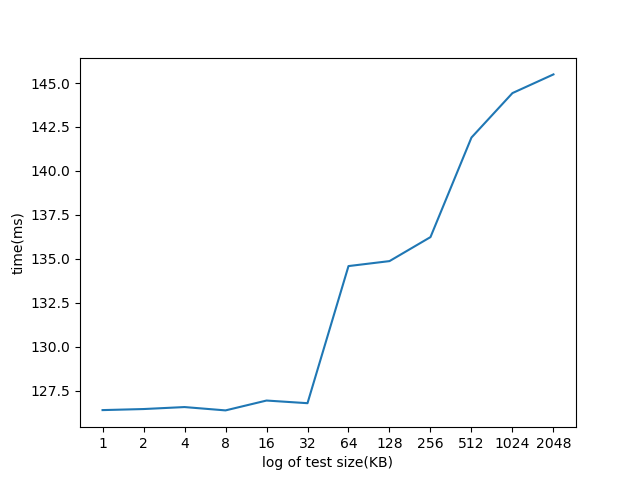
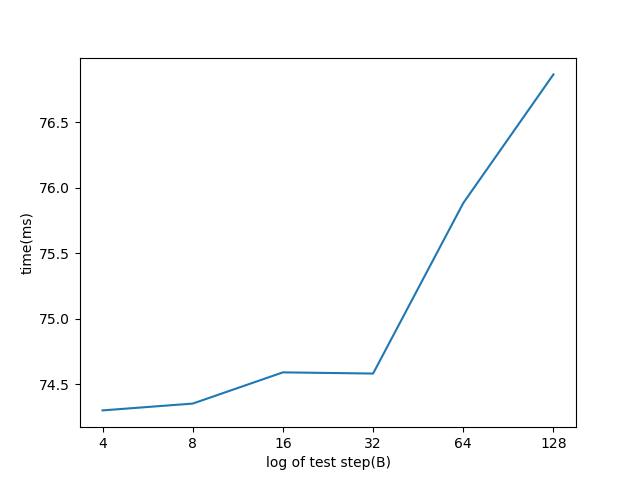

# 缓存测量实验报告

> 沙之洲 2020012408

## 0 本机 Cache 参数

通过 Coreinfo 查看本机处理器的 Cache 参数


Cache 相连度为 8；Cache line size 为 64B


后续实验均绑定到了核 3，所有程序在 wsl2 环境下运行


## 1 Cache Size

测试程序为 `size.cpp` ，访问方式是数组循环访问，步长为 16，总访存次数为 $2^{17}$ 次

可视化结果如下



可以看到，程序时间在 test size = 32 KB 的时候发生了明显的跳变，验证了 L1D Cache 32KB 的大小

同理，程序时间在 256 KB 的时候发生了明显的跳变，验证了 L2 Cache 256 KB 的大小

### 1.1 思考题

我的实验中在 256KB 的时候，相比于 128 KB ，已经出现了小幅度上升。说明出现了 L2 Cache 略有不匹配的现象。而 L1D Cache 的跳变是符合预期的。

其中的原因在于，L1 Cache 是指令和数据分离的，所以 test size 的跳变能够精确反应 L1D Cache 的大小。但是对于 L2 Cache，由于指令和数据的 Cache 是共用的，所以跳变的上升会略微提前发生，导致实验结果略有不匹配。


## 2 Cache Line Size 

测试程序为 `line.cpp` 

使用大小为 64KB 的数组，倍增访问步长。得到的结果如下



可以看到，在步长为 64B 的时候，程序时间发生了明显上升。验证了 Cache Line Size 为 64B

因为当步长和 Cache Line 大小相同的时候，相邻的两次访存所在的 Cache Line 必不相同，程序运行时间增加

### 2.1 思考题

prefetch 指的是在 DRAM 访存的时候，建立一次连接，传输多个 Cache Line。理论上来说，prefetch 会使得 Cache Line 测量出来的大小是 prefetch 的 Cache 大小，也即 Cache Line 的 n 倍。

但是实际上，在实验中我测量出来的 Cache Line 大小就是 1 倍的 Cache Line 大小。因此 prefetch 在我的实验中效果并不明显。


## 3 Cache 相连度

测试程序是 `associate.cpp` 

采用 64KB 大小的数组，为 L1D Cache 的两倍大

采用的算法是访问奇数块的中间

结果如下


当 group = 32 的时候时间有明显提升，验证了 L1D Cache 的相联度为 8

相联度算法的分析，在第 5 节

## 4 矩阵乘法优化

这一部分的代码在 `matrix.cpp` 当中

我对代码做了如下优化，交换了 k 和 j 循环的顺序

```c++
for (i = 0; i < MATRIX_SIZE; i ++)
        for (k = 0; k < MATRIX_SIZE; k ++)
            for (j = 0; j < MATRIX_SIZE; j ++)
                d[i][j] += a[i][k] * b[k][j];
```

这是考虑到原来是逐点计算 d 的值，但是会导致 a 的每一行被分散地扫描多次。

而我的改进可以让 a 的每一行集中被扫描


最终得到了 5.9 倍的加速比

## 5 相联度算法分析

使用了实验思路 1

我们将 Cache Size 简称为 total；Cache Line Size 简称为 line；Cache 组数简称为 block；Cache 相联度简称为 way

访问步长简称 step；数组分出的组数为 group
$$
group = 4 * way \\
step = \frac{2 total}{group} = \frac{total}{2*way} = \frac{1}{2}block * line \\
2 * step = block * line
$$
最后一行 2step 是因为访问其中奇数块。同时说明每次访问都会到 Cache 的同一个 block 里边。由于总的访问次数是 way 的两倍，所以 > way 的访问会造成相联度冲突，进而需要替换

如果 group 过小或者过大，会导致每次访存不在同一个 block 里边，所造成的相联度冲突少，所以时间会短


